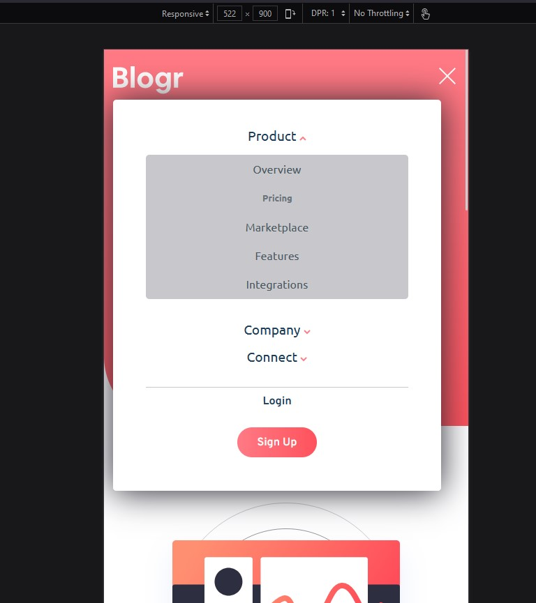
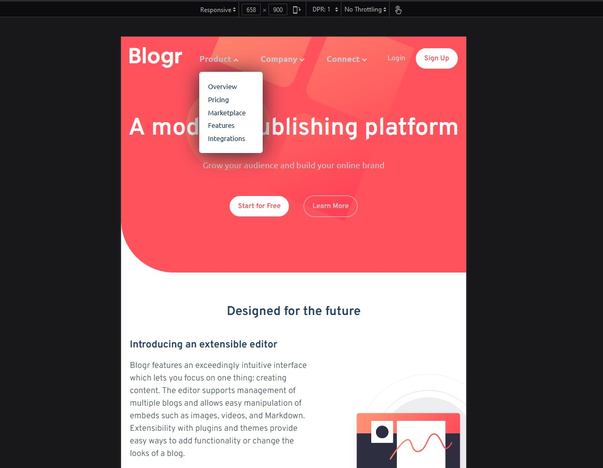
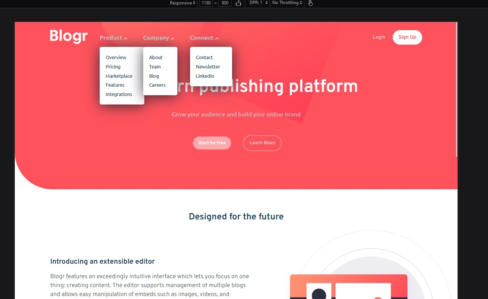

# Frontend Mentor - Blogr landing page solution

This is a solution to the [Blogr landing page challenge on Frontend Mentor](https://www.frontendmentor.io/challenges/blogr-landing-page-EX2RLAApP). Frontend Mentor challenges help you improve your coding skills by building realistic projects.

## Table of contents

- [Overview](#overview)
  - [The challenge](#the-challenge)
  - [Screenshot](#screenshot)
  - [Links](#links)
- [My process](#my-process)
  - [Built with](#built-with)
  - [What I learned](#what-i-learned)
  - [Continued development](#continued-development)
  - [Useful resources](#useful-resources)
- [Author](#author)
- [Acknowledgments](#acknowledgments)

## Overview

### The challenge

Users should be able to:

- View the optimal layout for the site depending on their device's screen size
- See hover states for all interactive elements on the page

### Screenshot

Mobile Layout of the Blogr:-



Tablet View of the Blogr:-



Large Screens Layout of the Blogr:-



### Links

- Solution URL: [github link](https://github.com/issagoodlifeInc/blogr-page.git)
- Live Site URL: [Netlify](https://blogr-leskim.netlify.app/)

## My process

Wrote down the Navigation Markup then toook a long long time geting it to be as responsive as posible with (2 media queries to negate the other media query)

Wrote the main patr and footer of the challenge while styling as required

Jotted down on this file👋🏾

### Built with

- Semantic HTML5 markup
- CSS custom properties
- Flexbox
- CSS Grid
- Mobile-first workflow

### What I learned

Responsive Navigations are quite tough to get a handle on
I have to handle more responsive navigation dependent challenges

Code to handle the dropdown nav items and the arrow pointing up or down as required

```js
mainLinks.forEach((link) => {
  link.addEventListener("click", (e) => {
    e.target.children[0].classList.toggle("point-up");

    if (e.target.children[0].classList.contains("point-up")) {
      e.target.nextElementSibling.style.display = "block";
    } else {
      e.target.nextElementSibling.style.display = "none";
    }
  });
});
```

### Continued development

Faster response time - took me about three weeks to get this done. (coming back to the code after a while was hectic to understund the stuff I had previously written)

Handling navigation easier - This part is the one that really gave me headaches on how to best handle it -- In the end I had to do 2 media queries to negate one another which I'm realy not proud of.

Writing better cod for others to easily go through and give feedback

## Author

- Website - [Lesley Kimutai](https://leskimfamily.herokuapp.com/lesley)
- Frontend Mentor - [@leskim](https://www.frontendmentor.io/profile/Leskim)
- Twitter - [@KimutaiLesley](https://www.twitter.com/KimutaiLesley)
